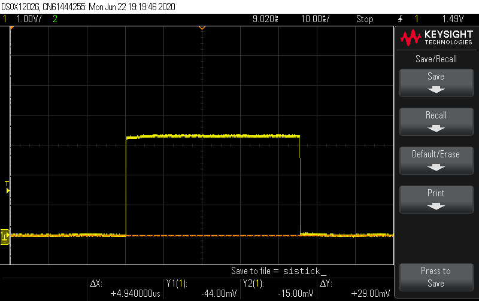
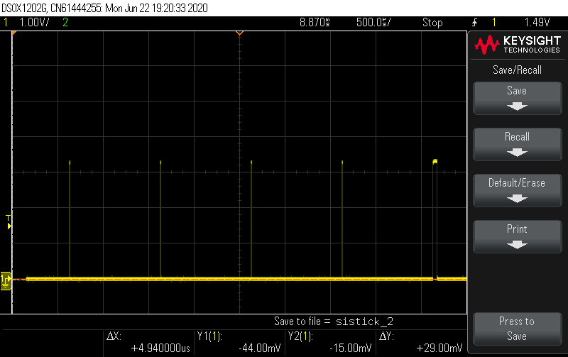
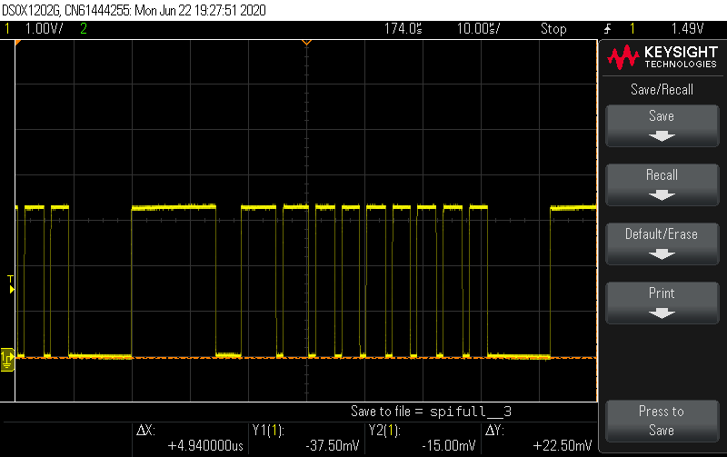
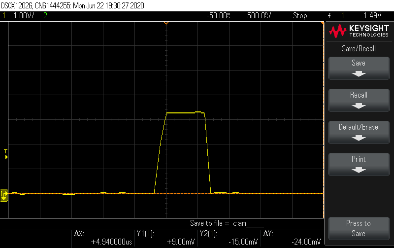

# Sistemas Embebidos - TP2
## Grupo 1

Integrantes: 
* Ana Negre
* Rodrigo Devesa 
* Cristóbal Kramer 
* Federico Gentile

### Descripción General

Este proyecto implementa un sistema de comunicación CAN para una placa FRDM-K64F, permitiendo la transmisión y recepción de datos a través de un bus CAN usando el transciever+controller MCP25625.

### Protocolos de Comunicación 

#### Protocolo Serial
El protocolo de comunicación serial está implementado en `protocol_handler.py` y define el siguiente formato de mensajes:

- **Frame de Ángulos**: `XYZ[R|C|O]VVVV\r\n`
  - `XYZ`: ID CAN en formato hexadecimal (3 dígitos ASCII)
  - `[R|C|O]`: Id del tipo de ángulo (Roll, Cabeceo, Orientación)
  - `VVVV`: Valor numérico del ángulo

- **Frame de LED Remoto**: `'L<byte>\r\n'`
  - Comando de LED para otras estaciones (solo se registra en log)

### Test Pins

Se incluyen pines específicos para verificar la funcionalidad de las interrupciones:

* `TP` `PTB2`, para interrupciones Systick (incluye interrupción periódica de I2C)
* `UART_TP` `PTB3`, SPI_TP `PTB10` para interrupciones de periféricos UART y SPI.
* `CAN_TP` `PTB11` para interrupciones dedicadas de puerto/gpio, configurada para la interrupción de CAN 
* `I2C` `PTC11` para interrupción del periférico I2C 

###  Resultados de las Mediciones - Duración de Interrupciones 
Se midieron las interrupciones mediante los pins de prueba indicados anteriormente y se compararon las mismas con lo esperado. Las imágenes pueden encontrarse en la carpeta `/imagenes`

#### * Interrupciones Periodicas (`SystemTick`/`PISR`)

En el caso de las interrupciones periodicas (cuyos _callbacks_ se interrupen una vez terminado el período del sistema, en este caso 1ms), se encontró que, en el peor caso, la interrupción dura cerca de 45 $\mu s$. 

Al investigar esto se concluyó que se debe a las funciones matemáticas realizadas por la función periódica de cálculo de ángulos en `_acc_magn_read_data()`.

No se encontró que esto perjudicara el funcionamiento del sistema, dado que esto solo sucede cada $25ms$ (período de la función de cálculo). Sin embargo se estima que en caso de sistemas más complejos sí puede volverse significativo, por lo que una mejor solución hubiese sido realizar la transformación de los vectores al requerirse la lectura de los mismos en la función `acc_magn_drv_get_angles()`, guardando únicamente los datos crudos en memoria.

En el caso de las otras interrupciones, se observó que las mediciones obtenidas se encontraban acorde a lo esperado en relación a su período. 

En el caso de spi, se pudo observar el contraste entre la transmisión de datos de posición y los subsecuentes `bit-modify`, `read` de registros, etc., siendo estos últimos más cortos en comparación ($14\mu s$ vs $\sim 5 \mu s$).

Se destaca el caso de la interrupción de CAN, que es extremadamente corta ya que la misma solo marca como pendiente una interrupción y luego el procesamiento de la misma se realiza desde la aplicación llamando a `can_process()`. 

### TiltNetworkTool

La carpeta `TiltNetworkTool-1.0.0-macOSfix` contiene una versión modificada de TiltNetwork para funcionar en macOS. 

**Nota**: Las modificaciones realizadas son específicamente para compatibilidad con macOS. El protocolo de comunicación requerido está definido en `protocol_handler.py`.

